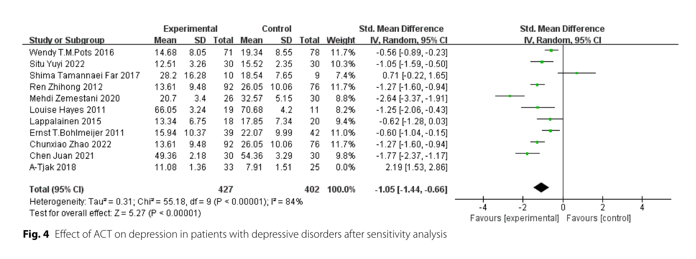

```{r include=FALSE}

# formatting options
# set default chunk options
knitr::opts_chunk$set(message = FALSE, 
                      warning = FALSE)

# disable scientific notation
options(scipen = 999) 

```

```{r}

library(tidyverse)
library(metafor)
library(readxl)
library(janitor)
library(ggstance)
library(knitr)
library(kableExtra)

```

# Reproduce Zhao's results

Zhao et al. (2023) present the results of multiple meta-analyses, sensitivity analyses, and subgroup analyses. Here, I attempt to reproduce and verify the result of only the first meta-analysis reported in the first forest plot (figure 4), which included the largest number of studies and data for the original studies' post-intervention time point.

Zhao et al. (2023, p. 6) reported "Effect of ACT on depression: Eleven studies reported the effect of ACT on depression levels in 887 patients with depressive disorders. There was statistically significant heterogeneity among the studies (P < 0.00001; I2= 93%), therefore, the random effects model was used to conduct meta-analysis. There was significant treatment effect from ACT in comparison to other treatments, as shown in the forest plot in Fig. 4."

However, Figure 4 does not present the full meta-analysis, but rather a sensitivity analysis after excluding A-Tjak et al. (2018). The rationale for excluding that study is not stated. I therefore first fit a meta-analysis to all 11 studies, then perform a series of outlier/undue influence tests to try to reproduce the conclusion that A-Tjak et al. (2018) should be excluded, and then finally I fit a new meta-analysis to the remaining 10 studies to try to reproduce the meta-analytic effect reported in Zhao et al. (2023) Figure 4. 

Summary stats (M, SD, N for both groups) were extracted from Zhao et al.'s (2023) forest plot in Figure 4. Specifically:

```{r}



```

## Meta-analysis of all 11 studies

```{r}

data_zhao <-
  read_xlsx(path = "../../data/raw/data_zhao_forest_plot_1_extracted.xlsx",
            sheet = "original")

data_zhao_all <- data_zhao %>%
  escalc(measure = "SMD",
         m1i = mean_exp,
         m2i = mean_control,
         sd1i = sd_exp,
         sd2i = sd_control,
         n1i = n_exp,
         n2i = n_control, 
         data = .)

fit_zhao_all <- 
  rma(data = data_zhao_all,
      yi = yi,
      vi = vi,
      slab = study,
      method = "DL") # NB Zhao et al. used the Revman software, which uses a DerSimonian-Laird estimator by default. I therefore use it here in all models.

forest(fit_zhao_all)

fit_zhao_all

```

## Outlier/undue influence tests

No specific justification was given in Zhao et al. (2023) for their exclusion of A-Tjak et al. (2018). In the absence of this, I employ {metafor}'s `influence()` function which applies multiple different metrics of undue influence.

```{r}

influence_zhao <- influence(fit_zhao_all, digits = 2)

influence_zhao 

plot(influence_zhao)

```

A-Tjak was detected as an outlier. Although Zhao et al.'s (2023) specific method of outlier detection is unknown, their conclusion is replicate by these results. 

## Sensitivity analysis: Exclude Tjak et al. (2018)

As in Zhao Figure 4, and following the results of the above outlier tests, I exclude A-Tjak et al. (2018) and fit a new meta-analysis in order to attempt to reproduce the results reported in Figure 4.

```{r}

data_zhao_excl_atjak <- data_zhao_all %>%
  filter(study != "A-Tjak 2018") 

fit_zhao_excl_atjak <- 
  rma(data = data_zhao_excl_atjak,
      yi = yi,
      vi = vi,
      slab = study,
      method = "DL") 

forest(fit_zhao_excl_atjak)

fit_zhao_excl_atjak

```

Zhao et al.'s (2023) forest plot in Figure 4 reported: Meta-analytic d = -1.05, 95% CI [-1.44, -0.66]. The results above therefore reproduce this result from the summary statistics reported in that forest plot.

# Reexracted

Although the results reported in Figure 4 can be reproduced from the summary statistics reported in Figure 4, the validity of those results are reliant on the summary statistics being accurately extracted from the original studies. Recent work has shown that this is frequently not the case (e.g., Maassen et al., 2020). I therefore attempted to extract the Mean, SD, and N for the ACT and control conditions at the post-intervention time point for each of the original studies.

In the below plots, I use the same labelling as in Zhao et al. (2023). The references (including DOIs) for the studies they refer to are available in the excel files that the data is loaded from. Note that there is imperfect correspondence between Zhao's labels and the authors of the original studies. 

## Comparisons of extracted summary stats

```{r}

data_reextracted <-
  read_xlsx(path = "../../data/raw/data_zhao_forest_plot_1_extracted.xlsx",
            sheet = "reextracted")

# table
comparisons <- 
  bind_rows(
    data_zhao |>
      select(study, mean_exp, sd_exp, n_exp, mean_control, sd_control, n_control) |>
      mutate(source = "Zhao et al. (2023)") |>
      relocate(source, .after = study),
    data_reextracted |>
      select(study, mean_exp, sd_exp, n_exp, mean_control, sd_control, n_control, reextracted) |>
      mutate(sd_exp = janitor::round_half_up(sd_exp, 2),
             sd_control = janitor::round_half_up(sd_control, 2),
             source = "Reextracted") |>
      relocate(source, .after = study)
  ) |>
  arrange(study, desc(source)) |>
  mutate(comparison = case_when(source == "Zhao et al. (2023)" ~ "",
                                reextracted == FALSE ~ "Indeterminable",
                                mean_exp != lag(mean_exp) | 
                                  mean_control != lag(mean_control) | 
                                  sd_exp != lag(sd_exp) | 
                                  sd_control != lag(sd_control) | 
                                  n_exp != lag(n_exp) | 
                                  n_control != lag(n_control) ~ "Inconsistent", 
                                TRUE ~ "Consistent"))

# summary table
comparisons |>
  filter(comparison != "") |>
  dplyr::count(comparison) |>
  kable() |>
  kable_classic(full_width = FALSE)

```

Two articles with DOIs were only available in Chinese for a fee, and were therefore not accessed. One article did not have a DOI listed and could not be found via internet searches. It is possible that the reference listed in Zhao et al. (2023) is an English translation of the original Chinese title. As such, the reproducibility of 3 of the 11 studies was indeterminable.  

In 3 of the remaining 8 articles, the summary statistics (M, SD, N) reported in Zhao et al. (2023, Figure 4) do not match those reported in the original studies. In two cases (Louise Hayes 2011, A-Tjak 2018), the original articles reported Standard Errors and these were employed by Zhao et al. (2023) as if they were Standard Deviations. This is a common and unfortunate issue in meta analyses, as is problematic as SEs are much smaller than SDs, therefore inflating the apparent Standardized Mean Difference effect sizes employed in the meta-analaysis. In one case (Mehdi Zemestani 2020), the Ns do not match those reported in the original publication, although the nature of the error is unclear. As such, only 5 of the 11 sets of summary statistics could be verified against the numbers reported in the original articles.

```{r}

# full table
comparisons |>
  kable() |>
  kable_classic(full_width = FALSE)

```


```{r}

# plot
compared_es <- comparisons %>%
  escalc(measure = "SMD",
         m1i = mean_exp,
         m2i = mean_control,
         sd1i = sd_exp,
         sd2i = sd_control,
         n1i = n_exp,
         n2i = n_control, 
         data = .) |>
  mutate(Comparison = ifelse(comparison == "", lead(comparison), comparison)) |>
  rename(Source = source) 

ggplot(compared_es, aes(yi, study, color = Source, shape = Comparison)) +
  geom_vline(xintercept = 0, linetype = "dotted") +
  geom_linerangeh(aes(xmin = yi - vi*1.96, xmax = yi + vi*1.96), position = position_dodge(width = 0.65)) +
  geom_point(position = position_dodge(width = 0.65), size = 2) +
  theme_linedraw() +
  scale_color_viridis_d(begin = 0.2, end = 0.6, direction = -1,
                     guide = guide_legend(reverse = TRUE)) +
  scale_shape_manual(values = c("Consistent" = 16, "Indeterminable" = 1, "Inconsistent" = 4)) +
  ylab("") +
  xlab("Standardized Mean Difference")

ggsave(filename = "verification_zhao_2023_comparisons_plot.pdf", 
       path = "../../communciations/plots/",
       create.dir = TRUE,
       width = 7,
       height = 4.5)

ggsave(filename = "verification_zhao_2023_comparisons_plot.png", 
       path = "../../communciations/plots/",
       create.dir = TRUE,
       dpi = 600,
       width = 7,
       height = 4.5)


# compared_es |>
#   mutate(yi = ifelse(Comparison != "Inconsistent" & Source == "Reextracted", NA, yi),
#          vi = ifelse(Comparison != "Inconsistent" & Source == "Reextracted", NA, vi)) |>
#   ggplot(aes(yi, study, color = Source, shape = Comparison)) +
#   geom_vline(xintercept = 0, linetype = "dotted") +
#   geom_linerangeh(aes(xmin = yi - vi*1.96, xmax = yi + vi*1.96), position = position_dodge(width = 0.65)) +
#   geom_point(position = position_dodge(width = 0.65), size = 2) +
#   theme_linedraw() +
#   scale_color_viridis_d(begin = 0.2, end = 0.6, direction = -1,
#                      guide = guide_legend(reverse = TRUE)) +
#   scale_shape_manual(values = c("Consistent" = 16, "Indeterminable" = 1, "Inconsistent" = 4)) +
#   ylab("") +
#   xlab("Standardized Mean Difference")

```


```{r fig.height=5, fig.width=5}

# library(wesanderson)
# library(RColorBrewer)

compared_es |>
  select(study, Source, yi) |>
  pivot_wider(names_from = Source, 
              values_from = yi) |>
  rename(zhao = "Zhao et al. (2023)",
         reextracted = Reextracted) |>
  mutate(Match = zhao == reextracted) |>
  ggplot(aes(zhao, reextracted, shape = Match)) +
  geom_abline(slope = 1, linetype = "dotted", alpha = 0.5) +
  geom_point(size = 2.25, alpha = 0.9) +
  theme_classic() +
  #scale_color_viridis_d(begin = 0.3, end = 0.6, option = "mako") +
  scale_shape_manual(values = c(4, 16)) +
  #scale_color_manual(values = wes_palette(n = 2, name = "Royal1")) +
  #scale_color_brewer(palette = "Dark2") +
  scale_x_continuous(breaks = scales::breaks_pretty(), 
                     limit = c(-3, 3),
                     name = "Reported in Zhao et al. (2023)") +
  scale_y_continuous(breaks = scales::breaks_pretty(), 
                     limit = c(-3, 3),
                     name = "Re-extracted from original articles") +
  theme(legend.position = "bottom") + 
  #legend.box.background = element_rect(colour = "black")) +
  annotate("text", x = 1.5, y = -1.5, size = 3, label = "Overestimates effect size") +
  annotate("text", x = -1.5, y = 1.5, size = 3, label = "Underestimates effect size") + 
  coord_fixed(ratio = 1)

ggsave(filename = "verification_zhao_2023_comparisons_plot_alt.pdf", 
       path = "../../communciations/plots/",
       create.dir = TRUE,
       width = 5,
       height = 4.5)

ggsave(filename = "verification_zhao_2023_comparisons_plot_alt.png", 
       path = "../../communciations/plots/",
       create.dir = TRUE,
       dpi = 600,
       width = 5,
       height = 4.5)

```

## Updated meta-analysis of all 11 studies

Following the same workflow as Zhao et al. (2023), a random effects meta-analysis was then fit to all 11 sets of effect sizes (i.e., including the 3 that were indeterminable, on the liberal assumption that they are correct).

```{r}

data_reextracted <- data_reextracted %>%
  escalc(measure = "SMD",
         m1i = mean_exp,
         m2i = mean_control,
         sd1i = sd_exp,
         sd2i = sd_control,
         n1i = n_exp,
         n2i = n_control, 
         data = .) 

fit_reextracted <- 
  rma(data = data_reextracted,
      yi = yi,
      vi = vi,
      slab = study,
      method = "DL")

forest(fit_reextracted, addpred = TRUE)

fit_reextracted

```

## Outlier/undue influence tests

Similarly, I then checked for outliers/undue influence.

```{r}

influence_reextracted <- influence(fit_reextracted, digits = 2)

influence_reextracted 

plot(influence_reextracted)

```

This suggests that Zemestani et al. (2020) is an outlier that should be excluded, whereas Zhao et al. (2023) excluded A-Tjak et al. (2018). 

Note that there are additional reasons to exclude the results of Zemestani et al. (2020): as documented in [this pubpeer comment](https://pubpeer.com/publications/0E13E34679B18385D6C4C29143A9CD), several results reported in that article fail StatCheck, GRIM, and GRIMMER tests (i.e., the reported results are mathmatically impossible); the reported SD of the BDI-II scores is implausibly small given normative data for the BDI-II elsewhere, and as a result the SMD effect size is implausibly large (d = -2.64 in Zhao et al. 2023).

## Sensitivity analysis: Exclude Zemestani et al. (2020)

I therefore fitted a new meta-analysis to the remaining 10 studies after excluding Zemestani et al. (2020).

```{r}

data_reextracted_excl_zemestani <- data_reextracted |>
  filter(study != "Mehdi Zemestani 2020")

fit_reextracted_excl_zemestani <- 
  rma(data = data_reextracted_excl_zemestani,
      yi = yi,
      vi = vi,
      slab = study,
      method = "DL")

forest(fit_reextracted_excl_zemestani, addpred = TRUE)

fit_reextracted_excl_zemestani

# reduction in ES compared to Zhao
round_with_zeros <- function(x, digits = 1) {
  sprintf(paste0("%.", digits, "f"), janitor::round_half_up(x, digits))
}

percent_change_in_ES <- round_with_zeros(as.numeric((fit_reextracted_excl_zemestani$b/fit_zhao_excl_atjak$b *100)) - 100)

```

A significant meta-analytic effect was still found, but this effect was `r percent_change_in_ES`% smaller than that reported by Zhao et al. (2023) after correcting the data extraction errors and refitting the meta-analysis and sensitivity analysis workflow. 

To preempt one possible response to these concerns: readers might argue something along the lines of "the conclusions of Zhao et al. (2023) are not substantially affected by the correction of these errors, and therefore there is no strong need for concern." However, any such reactions should be seen as worrisome rather than encouraging: meta-analyses are often argued to be at the top of the Evidence Pyramid, and their goal is to precisely estimate the true effect size beyond merely estimating whether the true effect size is non-zero or not. To retreat to the weaker position that the obtained effect size does not substantively matter is to undermine the point of doing the meta-analysis in the first place. Either the empirical estimates matter or they don't. 

Finally, as discussed at the start of this document, no attempt was made to reproduce or attempt to understand the impact of the detected extraction errors on the other analyses reported in Zhao et al. (2023). It is likely that the subgroup analyses reported after Figure 4 will also be affected by the issues detected above. It is also possible that other issues exist, given that errors were made at the relatively simple data extraction phase. The results and conclusions of Zhao et al. (2023) should therefore be regarded with great skepticism given the issues already detected, and require careful revision throughout to ensure no other errors were made. 

Equally, this verification does not attempt to critique things that were not done by Zhao et al. (2023). For example, the authors do not apply any method of bias correction for p-hacking or publication bias, and instead take the reported results at face value. Applying such tests typically shrinks the observed estimate. Equally, although the authors did include a risk of bias assessment, the results of that assessment were not employed in any sensitivity analysis (e.g., using bias scores as weights or as a method of exclusion).


